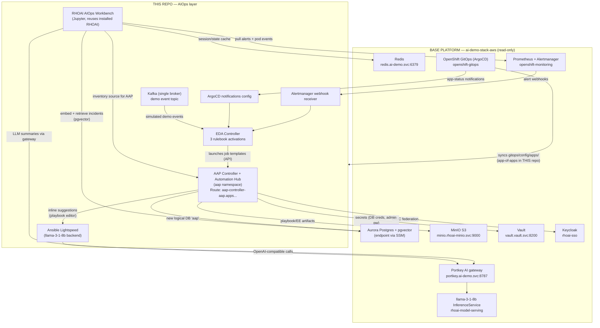
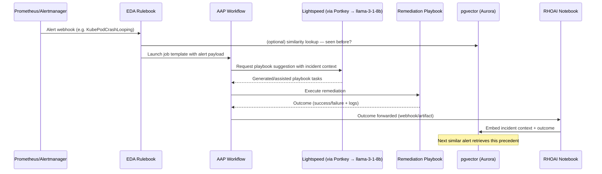

# Architecture

This layer adds four components on top of the existing
`ai-demo-stack-aws` base platform. Nothing in the base is modified;
every arrow into the base points at a service that already exists.

## Component diagram

## End-to-end event flow

## Design decisions

| Decision | Choice | Why |
|----------|--------|-----|
| AAP database | New logical DB `aap` in existing Aurora | ~$50/mo cheaper than a second cluster; base Aurora already HA (Q8 default) |
| Lightspeed backend | Self-hosted llama-3-1-8b via Portkey | Zero external API cost, stronger demo; Content Provider key can be supplied at deploy time to switch (Q5) |
| LLM routing | Everything through Portkey | Base lesson L4 — unified audit, cost tracking, rate limiting |
| EDA sources | Alertmanager + ArgoCD + Kafka | Spec requires three bootstrap activations; Kafka is single-broker, demo-only |
| Secrets | Vault (vault-injector annotations / init container) | Base lesson L5; no sealed-secrets assumed — gap documented in LESSONS_LEARNED if missing |
| Operator versions | Pinned channel + startingCSV, `installPlanApproval: Manual` for upgrades | Reproducibility rule; no `latest` |
| Delivery | ArgoCD app-of-apps in `gitops/config/apps/` | Existing openshift-gitops ArgoCD syncs this repo; bootstrap applies one file |
| Terraform state | `s3://ai-demo-stack-tfstate` key `demo/aiops.tfstate` | Same backend, separate lifecycle (Q7) |

## Namespaces created by this layer

| Namespace | Contents |
|-----------|----------|
| `aap` | AAP operator, AutomationController, AutomationHub, EDA Controller |
| `aiops-events` | Alertmanager webhook receiver, Kafka broker, event glue |
| `aiops-notebooks` | RHOAI workbench (Notebook CR), pipeline ConfigMaps |

Base lessons baked in day-1: every non-default-UID pod gets an SA +
anyuid (or narrower) RoleBinding (L1); externally-routed pods in mesh
namespaces carry `maistra.io/expose-route: "true"` (L2); new
StorageClasses over mutations (L3); all changes flow through git →
ArgoCD, never hot-patched (L6).
