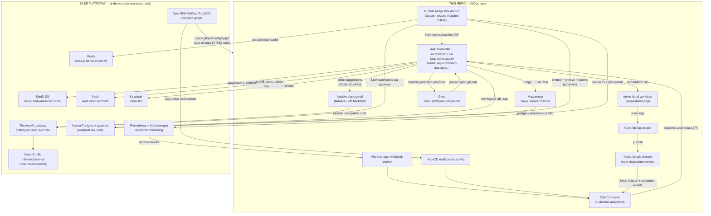
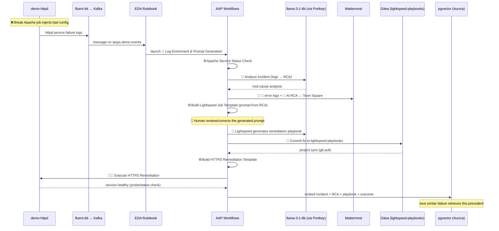

# Architecture

This layer adds four components on top of the existing
`ai-demo-stack-aws` base platform, built strictly to the objectives of
the Red Hat showroom lab
[AI-Driven Ansible Automation](https://rhpds.github.io/showroom-ai-driven-ansible-automation/modules/index.html):
**observability** (log collection → Kafka), **inference** (LLM log
analysis + Lightspeed playbook generation), **automation** (AAP
self-healing workflows). Nothing in the base is modified; every arrow
into the base points at a service that already exists.

Lab-parity mapping (showroom component → this stack):

| Showroom lab | This stack |
|--------------|-----------|
| RHEL webserver + httpd (systemd) | `demo-httpd` containerized workload (`aiops-demo-app` ns) |
| Filebeat → Kafka | fluent-bit log shipper → single-broker Kafka (`aiops-events` ns) |
| RHEL AI (Granite, `/v1/completions`) | llama-3-1-8b via **Portkey** (`portkey.ai-demo.svc:8787`, OpenAI-compatible) |
| Ansible Lightspeed | Lightspeed with self-hosted-model backend via Portkey |
| Gitea (generated-playbook repo) | Gitea rootless in `aiops-collab` ns, repo `lightspeed-playbooks` |
| Mattermost (Town Square notifications) | Mattermost Team Edition in `aiops-collab` ns, `mattermost` logical DB in Aurora |
| AAP workflows (Log Enrichment / Remediation) | Same workflow shapes, seeded as configuration-as-code |

## Component diagram

## End-to-end event flow

The canonical flow (UC-0, mirrors showroom lab modules 1–2):

The same spine serves the OpenShift-native flows (UC-1..3) with
Alertmanager webhooks or ArgoCD notifications replacing Kafka as the
event source — see [USE_CASES.md](USE_CASES.md).

## Design decisions

| Decision | Choice | Why |
|----------|--------|-----|
| AAP database | New logical DB `aap` in existing Aurora | ~$50/mo cheaper than a second cluster; base Aurora already HA (Q8 default) |
| Lightspeed backend | Self-hosted llama-3-1-8b via Portkey | Zero external API cost, stronger demo; Content Provider key can be supplied at deploy time to switch (Q5) |
| LLM routing | Everything through Portkey | Base lesson L4 — unified audit, cost tracking, rate limiting |
| EDA sources | Alertmanager + ArgoCD + Kafka | Spec requires three bootstrap activations; Kafka is single-broker, demo-only |
| Secrets | Vault (vault-injector annotations / init container) | Base lesson L5; no sealed-secrets assumed — gap documented in LESSONS_LEARNED if missing |
| Operator versions | Pinned channel + startingCSV, `installPlanApproval: Manual` for upgrades | Reproducibility rule; no `latest` |
| Delivery | ArgoCD app-of-apps in `gitops/config/apps/` | Existing openshift-gitops ArgoCD syncs this repo; bootstrap applies one file |
| Terraform state | `s3://ai-demo-stack-tfstate` key `demo/aiops.tfstate` | Same backend, separate lifecycle (Q7) |
| Generated-playbook VCS | In-cluster Gitea (`lightspeed-playbooks` repo) | Lab parity; keeps machine-generated playbooks out of this infra repo; zero external dependency |
| Notifications | In-cluster Mattermost (Team Edition, Aurora `mattermost` DB) | Lab parity (Town Square channel); no external chat SaaS needed |
| Demo failure target | Containerized `demo-httpd` instead of a RHEL VM | No VM infra on OCP; same httpd config-break scenario, probe-based verification |

## Namespaces created by this layer

| Namespace | Contents |
|-----------|----------|
| `aap` | AAP operator, AutomationController, AutomationHub, EDA Controller |
| `aiops-events` | Kafka broker (KRaft), fluent-bit shipper config, Alertmanager webhook receiver |
| `aiops-collab` | Gitea (lightspeed-playbooks repo), Mattermost (Town Square) |
| `aiops-demo-app` | `demo-httpd` breakable demo workload |
| `aiops-notebooks` | RHOAI workbench (Notebook CR), pipeline ConfigMaps |

Base lessons baked in day-1: every non-default-UID pod gets an SA +
anyuid (or narrower) RoleBinding (L1); externally-routed pods in mesh
namespaces carry `maistra.io/expose-route: "true"` (L2); new
StorageClasses over mutations (L3); all changes flow through git →
ArgoCD, never hot-patched (L6).
